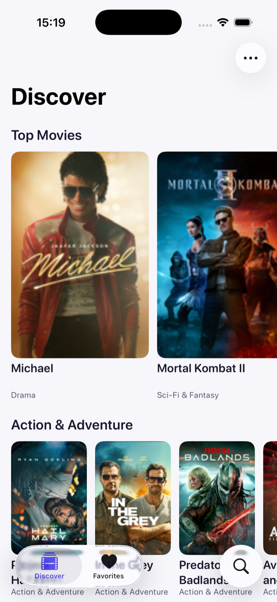
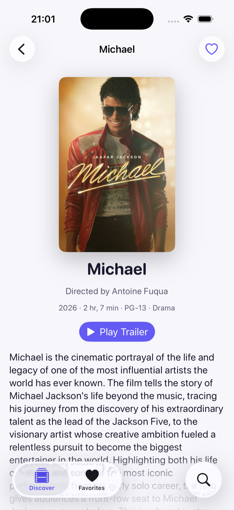
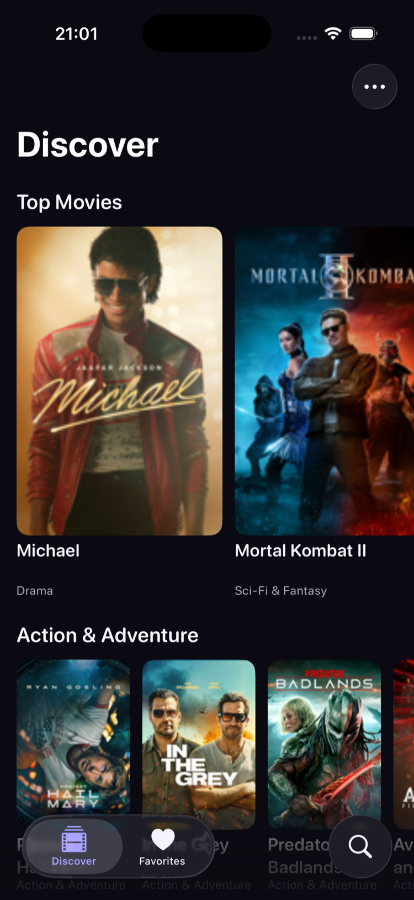
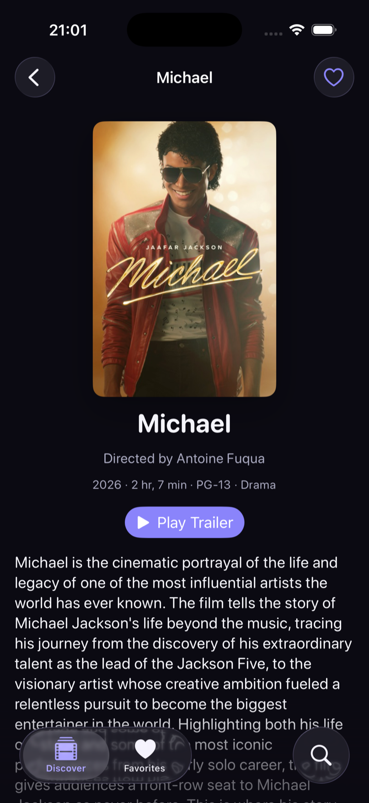
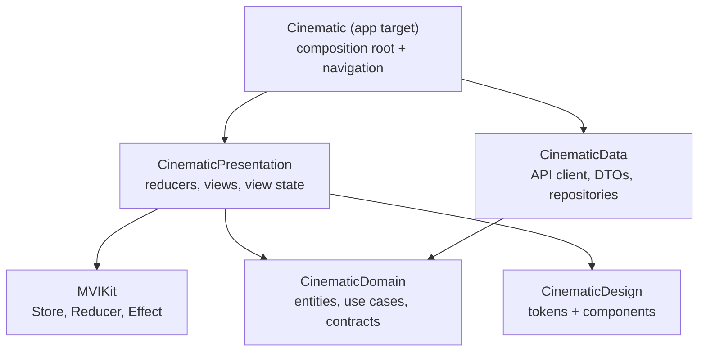
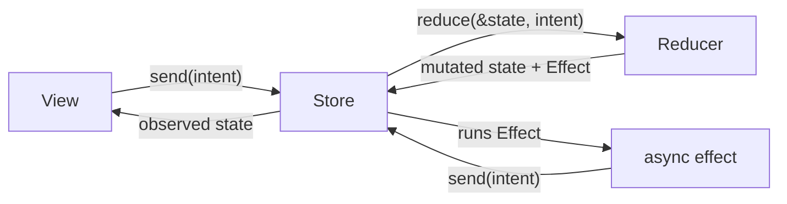

# Cinematic

MVI + Clean Architecture for SwiftUI, shown working. Cinematic is a complete movie app for iOS 26 — Swift 6, five layered Swift packages, typed throws end to end, and tests at every seam. It exists to be read: every decision is documented, and nothing is a toy stub.

[](https://github.com/Khizanag/Cinematic-iOS/actions/workflows/ci.yml)


[](https://khizanag.github.io/Cinematic-iOS/)
[](https://github.com/Khizanag/Cinematic-iOS/stargazers)

| Discover | Movie detail | Discover, dark | Detail, dark |
|---|---|---|---|
|  |  |  |  |

No API keys, no accounts, no setup. Clone, open, run — the catalog comes from Apple's public iTunes feeds.

**[Read the full walkthrough on the documentation site →](https://khizanag.github.io/Cinematic-iOS/)**

## Contents

- [Why this repository exists](#why-this-repository-exists)
- [The architecture in one diagram](#the-architecture-in-one-diagram)
- [The MVI loop](#the-mvi-loop)
- [What it demonstrates](#what-it-demonstrates)
- [How it compares: MVI vs MVVM vs MV vs TCA](#how-it-compares-mvi-vs-mvvm-vs-mv-vs-tca)
- [Quick start](#quick-start)
- [Project layout](#project-layout)
- [Documentation](#documentation)
- [Testing](#testing)

## Why this repository exists

Most architecture write-ups demonstrate MVI on a counter and Clean Architecture on a diagram. The gap is the middle: a codebase small enough to read in an evening but real enough to face what production code faces — an API with quirks, caching, cancellation, localization, accessibility, error states, and tests that prove the design claims. Cinematic is that middle.

## The architecture in one diagram



The arrows are the whole doctrine. Dependencies point inward, and the package manifests *enforce* it: `CinematicPresentation` cannot import `CinematicData` because its `Package.swift` never declares it. Only the app target — the composition root — knows concrete data sources and injects them behind domain protocols.

## The MVI loop



- **State** — one value type holding everything a screen shows.
- **Intent** — everything that can happen to it: user actions and effect results, one closed set.
- **Reducer** — the only place state changes. Pure, synchronous, returns an `Effect` describing async work.
- **Store** — runs the loop, executes effects, and is the only object a view talks to.

The whole machinery is [`MVIKit`](Package/MVIKit) — about 250 lines you can read top to bottom. [docs/MVI.md](docs/MVI.md) walks through every type.

## What it demonstrates

- Debounced, cancellable search: one `EffectID` gives switch-latest semantics, so a stale response can never overwrite a fresh one.
- Stream-driven favorites: screens observe one `AsyncStream` source of truth, so the heart on a detail screen and the favorites tab can never disagree.
- An offline decorator: `CachedMovieCatalogRepository` wraps the live repository behind the same protocol and serves the last good answer when the network fails.
- Typed throws end to end: repositories throw `MovieError`, reducers catch `MovieError`, and `LoadingPhase<Value, Never>` proves at compile time that local favorites need no error UI.
- Honest API work: the iTunes RSS feed wraps every scalar in `{"label": …}`, prefixes keys with `im:`, and ships `entry` as an array, a bare object, or nothing — the DTOs handle all of it, tested.
- Per-screen skeletons, `ContentUnavailableView` for empty and error states, Dynamic Type, VoiceOver labels, Reduce Motion guards, and a String Catalog per module — localized in English and German, with locale-aware price and date formatting.
- Deep links (`cinematic://movie/<id>`), a coordinator-driven `NavigationStack` per tab, and UI tests that run against an injected in-memory world.

## How it compares: MVI vs MVVM vs MV vs TCA

SwiftUI leaves room for several architectures, and the right one depends on how hard the state is. Model-View-Intent earns its keep when state is genuinely hard — concurrent loads, cancellation, multiple sources you must keep consistent. When it isn't, a lighter pattern wins:

| Pattern | Reach for it when | The trade-off |
|---|---|---|
| **MV** (`@Observable` model) | A screen has one source of truth and little logic | View and logic blur as the screen grows |
| **MVVM** | You want testable view logic without much ceremony | No built-in story for side effects or cancellation |
| **MVI** — *what Cinematic uses* | State has races, cancellation, or several sources to reconcile | One reducer plus effects per feature is more structure upfront |
| **TCA** | A large app needs composable features and exhaustive test tooling | A third-party dependency and a steeper learning curve |

`MVIKit` is the smallest thing that makes the MVI guarantees true — read it before reaching for a framework, so you know exactly what a framework would buy you. [docs/MVI.md](docs/MVI.md) goes deep on the reducer, effect cancellation, and testing.

## Quick start

```bash
git clone https://github.com/Khizanag/Cinematic-iOS.git
cd Cinematic-iOS
open Cinematic.xcodeproj
```

Select the `Cinematic` scheme and run on any iOS 26 simulator. Requires Xcode 26 or later.

## Project layout

```text
Cinematic-iOS/
  Cinematic.xcodeproj
  Cinematic/                  ← app target: composition root, navigation, About
    App/
      Navigation/             ← coordinators, Screen/Sheet/Cover, factories
      Dependencies.swift      ← the composition root
    Feature/About/
    Resource/
  CinematicTests/             ← composition + deep-link tests
  CinematicUITests/           ← XCUITest flows over the stubbed world
  Package/
    MVIKit/                   ← the pattern: Store, Reducer, Effect, LoadingPhase
    CinematicDomain/          ← entities, use cases, repository contracts
    CinematicData/            ← iTunes API, DTOs, mappers, caching, persistence
    CinematicDesign/          ← DesignSystem tokens + reusable components
    CinematicPresentation/    ← the four features, one folder each
  docs/                       ← the long-form documentation
```

## Documentation

Read it all on the **[documentation site](https://khizanag.github.io/Cinematic-iOS/)**, or in-repo:

| Document | Covers |
|---|---|
| [docs/ARCHITECTURE.md](docs/ARCHITECTURE.md) | The layers, the dependency rule, the composition root, concurrency, trade-offs |
| [docs/MVI.md](docs/MVI.md) | Every MVIKit type, effect cancellation, bindings, testing stores |
| [docs/ADDING-A-FEATURE.md](docs/ADDING-A-FEATURE.md) | The step-by-step recipe, from use case to pushed screen |
| [docs/TESTING.md](docs/TESTING.md) | What each layer's tests prove and how the doubles work |
| [docs/ACCESSIBILITY.md](docs/ACCESSIBILITY.md) | The VoiceOver, Dynamic Type, Reduce Motion / Transparency, and localization story |

Each package also carries its own short README.

## Testing

```bash
# Platform-agnostic packages — run anywhere, no simulator
cd Package/MVIKit && swift test
cd Package/CinematicDomain && swift test
cd Package/CinematicData && swift test

# UI packages and the app — run on an iOS 26 simulator
xcodebuild test -scheme CinematicDesign -destination 'platform=iOS Simulator,name=iPhone 17'
xcodebuild test -scheme CinematicPresentation -destination 'platform=iOS Simulator,name=iPhone 17'
xcodebuild test -project Cinematic.xcodeproj -scheme Cinematic -destination 'platform=iOS Simulator,name=iPhone 17'
```

79 tests across six suites: reducer state machines, use-case rules, DTO decoding against captured payloads, repository behavior over a stubbed `URLProtocol`, persistence round-trips, composition wiring, and three black-box UI flows. `swiftlint --strict` passes with zero violations.

## Contributing

Issues and pull requests are welcome — see [CONTRIBUTING.md](CONTRIBUTING.md). If this project made MVI or Clean Architecture click for you, a ⭐️ helps other iOS developers find it.

## License

MIT — see [LICENSE](LICENSE).
