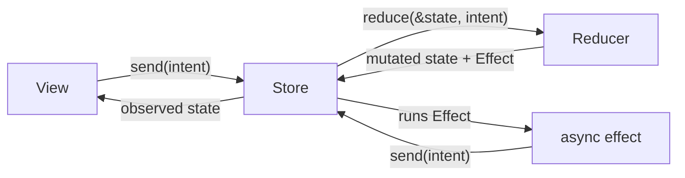
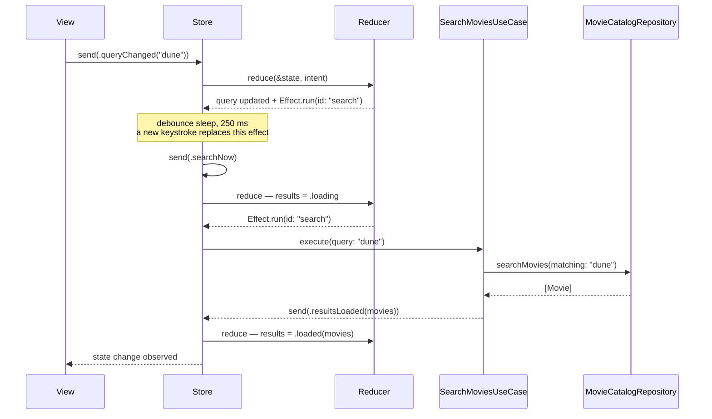

# MVI in this codebase

Model–View–Intent, as implemented by `MVIKit` and used by every feature. This is the long-form chapter: read it next to the package source — the whole pattern is about 250 lines.

## The idea

MVI is unidirectional data flow with a closed vocabulary. The view never mutates anything; it *describes what happened* as an intent. A pure reducer turns intents into new state and into descriptions of side effects. Effects run asynchronously and report back — as intents. One loop, one direction, no second way to change state.



What you buy: every state transition has a named cause, the entire state machine is unit-testable without UI, and concurrency bugs lose their favorite hiding place (ad-hoc mutation from async callbacks).

## The vocabulary

### State

One value type per feature, holding everything the screen renders:

```swift
struct State: Equatable {
    var query = ""
    var results: LoadingPhase<[Movie], MovieError> = .idle
}
```

`Equatable` is non-negotiable here — it is what lets tests assert whole states value-for-value.

### Intent

One enum covering *everything that can happen*: user actions and effect results alike.

```swift
enum Intent: Sendable {
    case queryChanged(String)   // the user typed
    case searchNow              // the debounce elapsed
    case resultsLoaded([Movie]) // the effect succeeded
    case searchFailed(MovieError)
}
```

Keeping system events in the same enum is deliberate: the reducer remains the single audit log of why state changed. Past-tense names for results (`resultsLoaded`), imperative for commands (`searchNow`), user-event phrasing for input (`queryChanged`).

### Reducer

A pure value. Dependencies (use cases) are stored properties injected by the composition root. `reduce` mutates state synchronously and returns an `Effect` — it never awaits, never touches a repository, never dispatches.

```swift
func reduce(_ state: inout State, _ intent: Intent) -> Effect<Intent> {
    switch intent {
    case .searchNow:
        state.results = .loading
        return search(query: state.query)
    // …
    }
}
```

### Effect

A *description* of asynchronous work, not the work itself:

```swift
return .run(id: Self.searchEffect) { send in
    do throws(MovieError) {
        let movies = try await searchMovies.execute(query: query)
        await send(.resultsLoaded(movies))
    } catch {
        await send(.searchFailed(error))
    }
}
```

`Effect` values compose with `.merge`, cancel with `.cancel(id)`, and report back only through `send` — which hops to the main actor and silently drops intents from cancelled work.

### Store

`Store<R: Reducer>` is `@MainActor @Observable`. Views read `store.state` and call `store.send(_:)`; `state` has a private setter, so the loop is the only path. The store also bridges SwiftUI's binding-shaped APIs without breaking the loop:

```swift
.searchable(text: store.binding(\.query) { .queryChanged($0) })
```

Reads come from state; writes go through the reducer.

## Cancellation: the part most MVI posts skip

Every `.run` can carry an `EffectID`. The store keeps one task per id; starting a new run with the same id **cancels the previous one** (switch-latest), and `.cancel(id)` stops it outright.

Search shows why this is the right primitive. Debounce sleep and the request share the id `"search"`:



A keystroke during the sleep replaces the effect (the old task's `send` becomes a no-op). A keystroke during the request replaces the request. At most one search pipeline exists, so a slow stale response can never overwrite a fresh one — by construction, not by flag-checking.

Long-lived effects use the same mechanism: the detail screen starts an `observeFavorites` effect whose `for await` loop lives as long as the store. When the view goes away, the store deinitializes and cancels it. Lifecycle management is structural.

## LoadingPhase and typed failures

Every async load in a state is a `LoadingPhase<Value, Failure>` — `idle`, `loading`, `loaded(Value)`, `failed(Failure)` — so views `switch` once and every case has exactly one rendering (skeleton, content, or error). Two details matter:

- `Failure` is the *domain* error type, so phases stay `Equatable` and tests compare whole states.
- `LoadingPhase<[Movie], Never>` (the favorites tab) is a compiler-checked claim: this load cannot fail, and no error UI exists because none can be needed.

## What belongs in an Intent

Rule of thumb: **intents are events that change state.** Tapping a movie card changes no state on the current screen — it navigates. So feature views emit plain events (`onSelectMovie`) that the app's factories translate into coordinator calls, and reducers stay free of routing.

This is a deliberate departure from navigation-in-the-reducer styles (TCA's tree-based routing, for example). Both are legitimate; this codebase optimizes for features that are previewable in isolation and a single file that answers "where does this tap lead?". If a navigation decision ever *depends on state* (tap behaves differently mid-upload, say), route it through an intent and let the reducer expose the decision — then navigate on the result.

## Testing stores

Reducers are pure, so transitions are one-liners. The interesting part is the loop, and `Store` ships two test hooks:

- `settle()` — awaits every in-flight effect, including effects started by the intents those effects send. Perfect for request-shaped work: `send(.task)`, `await settle()`, assert the final state.
- `hasPendingEffects` — asserts quiescence, e.g. that a repeated `.task` did not start duplicate work.

Stream-fed stores never settle (their effect is deliberately immortal), so those tests poll with a bounded `waitUntil` helper instead, driving the stub repository and asserting the state follows. See [TESTING.md](TESTING.md) for the full patterns.

## When to choose this

| Situation | Reach for |
|---|---|
| Screen state is trivial, one fetch, no races | Plain `@Observable` model (MV) — MVI would be ceremony |
| Logic worth unit-testing, simple flows | MVVM with an observable view model |
| Races, cancellation, multi-source state, audit-ability | MVI — this repo's territory |
| Many teams, deep feature composition, exhaustive exhaustiveness | TCA — same ideas, industrial tooling |

MVIKit is intentionally the smallest thing that makes the MVI claims true. If you outgrow it, you'll know exactly what you are buying from a framework — because you've read the 250 lines it replaces.

## Anti-patterns to refuse

| Smell | Why it breaks the model |
|---|---|
| Mutating state outside `reduce` | The audit log lies; tests stop covering reality |
| Awaiting inside `reduce` | Reducers must be synchronous and total; async belongs in effects |
| Effects reading `store.state` directly | Capture what you need in the reducer; effects get values, not state access |
| A second "manager" object feeding the view | Two sources of truth; fold it into state or a repository |
| Booleans like `isLoading` + `errorMessage` pairs | That's `LoadingPhase` spelled with race conditions |
